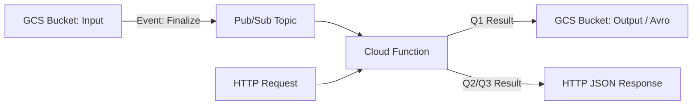

# Data Engineer Challenge Solution

Como el reto no tiene mucho código, todo se documenta aquí en un solo archivo para facilitar la lectura. Para mejorar la redacción y evitar la redundancia se hace uso de IA para mejora rla docuemntación.

## 1. Ambiente de Desarrollo

El reto pide buenas prácticas de git. Para eso, lo primero es que cualquiera pueda configurar el ambiente fácil:

```bash
make setup
```

### 1.1. Automatización (`Makefile`)
Centraliza los comandos del proyecto (`setup`, `lint`, `test`, `clean`) para que todos hagan lo mismo de la misma forma. Es robusto, agnóstico al lenguaje y está en casi todos los sistemas. En Windows se instala con `scoop install make` o revisando la [documentación oficial](https://www.gnu.org/software/make/).

### 1.2. Entorno Virtual (`uv`)
Maneja ambientes de Python y paquetes. Se usa por su buen rendimiento y porque genera archivos de `lock` y gestiona `.toml` bien en proyectos complejos.

### 1.3. Dependencias
- `requirements.txt`: paquetes del proyecto
- `requirements-dev.txt`: dependencias de desarrollo (linters, testing) + invoca `requirements.txt` para que el ambiente de desarrollo sea un superconjunto del de producción

### 1.4. Git Hooks (`pre-commit`)
Automatiza revisión y formateo *antes* del commit. El código que llega al repo cumple los estándares.

**Herramientas:**
- `Ruff`: linter y formateador que detecta errores y code smells
- `detect-secrets`: previene que API keys, passwords, etc. se suban al repo

### 1.5. Commits Convencionales (`Commitizen`)
Fuerza formato estándar en los commits. Mejora la legibilidad del historial, facilita changelogs y permite automatizar versiones.

```bash
make commit  # en lugar de git commit
```

### 1.6. Flujo Git (GitFlow simplificado)
- `main`: versión estable de producción
- `develop`: rama principal donde se integra todo
- `feature/<nombre>`: ramas para nuevas funcionalidades, creadas desde `develop`

Mantiene historial limpio y facilita tanto desarrollo como mantenimiento.

## 2. Exploración de Datos

Archivo: `farmers-protest-tweets-2021-2-4.json`

### 2.1. Estructura
- **Formato**: JSONL (cada línea es un JSON independiente)
- **Volumen**: 117,407 registros (~400MB+)
- **Campos clave**:
  - `date`: timestamp del tweet → **Q1**
  - `content`: texto con emojis → **Q2**
  - `user.username`: usuario que tweetea → **Q1**
  - `mentionedUsers`: lista de usuarios mencionados → **Q3**

### 2.2. Identificadores
- `id`: numérico de 64 bits, identifica cada tweet único
- `url`: también sirve como identificador único
- **Usuario**: Tiene `user.id` (inmutable) y `user.username` (puede cambiar según documentación de Twitter). Un usuario puede aparecer múltiples veces (varios tweets)
- **Importante para Q1**: Se agrupa internamente por `user.id` para evitar fragmentar métricas si alguien cambió su nombre durante el periodo. Aunque el reto pide devolver `username` (string), primero se cuenta por ID y luego se mapea al username más reciente

### 2.3. Variables necesarias para el análisis

Teniendo en cuenta que cada pregunta requiere un tipo de análisis diferente:

**Q1.** Las top 10 fechas donde hay más tweets. Mencionar el usuario (username) que más publicaciones tiene por cada uno de esos días.
```python
[(datetime.date(1999, 11, 15), "LATAM321"), (datetime.date(1999, 7, 15), "LATAM_CHI"), ...]​
```

**Q2.** Los top 10 emojis más usados con su respectivo conteo.
```python
[("✈️", 6856), ("❤️", 5876), ...]
```

**Q3.** El top 10 histórico de usuarios (username) más influyentes en función del conteo de las menciones (@) que registra cada uno de ellos.
```python
[("LATAM321", 387), ("LATAM_CHI", 129), ...]
```

Variables necesarias para responder cada pregunta:

| Pregunta | Variable | Uso |
| :--- | :--- | :--- |
| **Q1** | `date` | Agrupación cronológica por día. |
| **Q1** | `user.id` | Identificación del autor para el conteo por día (inmutable). |
| **Q1** | `user.username` | Mapeo final para devolver el string solicitado. |
| **Q2** | `content` | Extracción de emojis del texto. |
| **Q3** | `mentionedUsers` | Lista de usuarios mencionados. |
| **Q3** | `mentionedUsers.username` | Identificación del usuario mencionado para el conteo histórico. |

### 2.4. Errores y Casos Borde

La explicación del objeto tweet está en la [documentación oficial de Twitter](https://developer.twitter.com/en/docs/twitter-api/v1/data-dictionary/overview/tweet-object). Complementando con investigación usando IA (Gemini), se identifican casos de negocio comunes:

**A. El problema de la "Doble Identidad" (Q1)**

La documentación de Twitter indica que un usuario puede cambiar su `username` (handle), pero su `id` es inmutable. Si un usuario cambió su nombre durante el periodo del dataset, contarlo por `username` podría fragmentar sus métricas.

**Decisión**: Aunque el reto pide devolver el `username`, internamente se agrupa por `id` y luego se mapea al `username` más reciente.

**B. El campo `mentionedUsers` vs. @texto (Q3)**

El reto pide menciones basadas en el conteo de `@`. Sin embargo, el campo `mentionedUsers` es un objeto enriquecido por Twitter que ya parseó el texto.

**Caso Borde**: ¿Qué pasa si el texto dice `@usuario` pero el objeto `mentionedUsers` es `null` (común en tweets borrados o para cuentas suspendidas)?

**Decisión**: Se usa el campo estructurado `mentionedUsers` (más eficiente y captura menciones "invisibles" como hidden/reply) en lugar de regex sobre el texto. Si es `null`, el tweet no cuenta menciones aunque el texto tenga `@`.

**C. La trampa de los Emojis Compuestos (Q2)**

Los ZWJ (Zero Width Joiners) unen múltiples emojis. Ejemplo: el emoji de "Familia" 👨‍👩‍👧‍👦 es en realidad 4 emojis unidos por caracteres invisibles.

**Decisión**: Se usa `emoji.analyze()` con soporte para secuencias ZWJ completas. De lo contrario, el top 10 se llenará de "hombres", "mujeres" y "niños" individuales en lugar de "familia".

**D. Q1: El desafío del "Usuario con más tweets por día"**

Esta pregunta es un Top-N de un Top-N:
1. Encontrar los Top 10 días con más tweets
2. Para cada uno de esos 10 días, encontrar el usuario más activo

**Decisión**: Optimización en 2 pasos para no guardar diccionario gigante `{fecha: {usuario: cuenta}}`:
- Paso 1: Contar tweets por fecha y obtener Top 10 fechas
- Paso 2: Solo para esas 10 fechas, acumular conteos de usuarios

**E. La Pesadilla de Unicode (Normalización NFKC)**

En Q1 (usernames) y Q2 (emojis), Python puede traicionar si no se normaliza Unicode.

**El Problema**: El carácter `ñ` se puede escribir de dos formas en bytes:
1. Como un solo carácter (U+00F1)
2. Como `n` + símbolo `~` (U+006E + U+0303)

**El Riesgo**: Para Python, `"Peña" != "Peña"`. Si no se normaliza, `collections.Counter` los cuenta como dos usuarios o emojis distintos, fragmentando el Top 10.

**Decisión**: Aplicar `unicodedata.normalize('NFKC', text)` antes de contar.

**F. Comportamiento de Bots (Outliers en Q1)**

Q1 pide el usuario con más tweets por día. En eventos como el Farmers Protest hay muchos bots.

**El Riesgo**: Si un usuario tiene 5,000 tweets en un día (bot haciendo spam), técnicamente es el "Top 1", pero ensucia el análisis.

**Decisión**: Se reportan tal cual lo pide el enunciado, pero se verifica la distribución de tweets por usuario. Si el Top 1 tiene 100x más tweets que el Top 2, se menciona en documentación como observación de calidad de datos.

**G. Case Sensitivity (Q1 y Q3)**

Twitter trata los usernames como case-insensitive, pero los datos crudos pueden variar.

**El Riesgo**: `@Latam321` y `@latam321` son la misma persona. Si se cuentan strings crudos, se divide su influencia.

**Decisión**: Convertir siempre a `.lower()` antes de agrupar en Q1 y Q3.

**H. Determinismo en Empates (Sorting)**

**El Problema**: El reto pide "Top 10". ¿Qué pasa si el usuario #10 y el #11 tienen exactamente 50 tweets?

**El Riesgo**: El ordenamiento estándar de Python (`sort`) es estable, pero sin criterio de desempate explícito, el código podría devolver resultados diferentes en ejecuciones distintas en sistemas distribuidos.

**Decisión**: Implementar criterio de ordenamiento secundario: `sort(key=lambda x: (-count, username))` para garantizar determinismo.

Para analizar estos y otros casos presentes en los datos, se realiza una exploración de una muestra en [challenge.ipynb](src/challenge.ipynb).

Tras un análisis estadístico de 10,000 registros, se identificaron los siguientes casos críticos:

**Análisis Estadístico de Calidad (n=10,000):**
- **Integridad Estructural**: No se detectaron discrepancias de tipos en `date` (100% string) o `content` (100% string)
- **Menciones (Q3)**: El campo `mentionedUsers` es altamente volátil. El 67.28% de los tweets son `null` (NoneType), mientras que el 32.72% son listas. No se detectaron listas vacías (`[]`)
- **Complejidad de Texto (Q2)**: Se detectaron 821 emojis complejos (multi-char/compound). Emojis como `🙏🏻` (manos en oración con tono de piel) o banderas como `🇮🇳` requieren tratamiento de grafemas
- **Extremos de Contenido**: Tweets desde 15 hasta 852 caracteres, implica que el parsing de texto debe ser eficiente
- **Ratio de Repetición de Usuarios**: 2.20x, justifica el uso de `sys.intern()` para optimizar memoria

**Casos Borde y de Negocio Identificados:**

| Variable | Caso de Prueba / Anomalía | Frecuencia / Ejemplo | Estrategia de Mitigación |
| :--- | :--- | :--- | :--- |
| `date` | Desfase de Zona Horaria | `2021-02-21T23:39:32+00:00` | Normalización mandatoria a UTC `.date()` para evitar saltos de día. |
| `content` | Emojis con ZWJ (Zero Width Joiners) | `👨‍👩‍👧‍👦` = 4 emojis unidos | Uso de `emoji.analyze()` con soporte para secuencias ZWJ completas. |
| `content` | Multilingüismo (Hindi/Punjabi) | `.@RakeshTikaitBKU बोले- संसद जाकर...` | El parser debe soportar codificación `utf-8` para no corromper texto en otros idiomas. |
| `content` | Truncamiento (Legacy) | Clave `truncated` no existe | El dataset parece pre-procesado (aplanado), pero se valida fin de texto `…`. |
| `mentionedUsers` | Menciones "Invisibles" | Hidden/Reply | Uso de metadata `mentionedUsers` en lugar de Regex para capturar menciones que no están en el texto visible. |
| `mentionedUsers` | Referencia Nula vs @texto | `null` vs `@falso_positivo` | Se prioriza metadata oficial sobre Regex para evitar falsos positivos de texto. |
| `user.username` | Ratio de Repetición | 2.20x | Justifica el uso de `sys.intern()` para optimizar memoria RAM. |
| `all` | Retweets (Duplicidad) | `RT @...` (0.05% muestra) | Interpretación estricta: se cuentan los emojis/menciones de RTs como publicaciones nuevas. |

**Conclusiones:**
- El archivo es grande (~400MB+). Leerlo completo en memoria (`json.load`) puede causar problemas en recursos limitados
- **Recomendación**: procesamiento por streaming (línea por línea) para optimizar memoria
- La estructura anidada (`user`, `mentionedUsers`) requiere navegación cuidadosa del JSON para evitar errores por campos nulos

## 3. Estrategias de Optimización

Una de las estrategias centrales es aprovechar capacidades nativas y librerías optimizadas para maximizar la eficiencia en ambos frentes:

- **String Interning (`sys.intern`)**:
  - **Memoria**: Basado en un **ratio de repetición de 2.20x**, esta técnica fuerza a Python a reutilizar el mismo objeto en RAM para valores idénticos. Reduce el *footprint* al evitar duplicados de texto denso en los diccionarios de Q1 y Q3.
  - **Tiempo**: Acelera los agrupamientos y búsquedas, ya que las comparaciones entre strings "internados" se realizan por dirección de memoria (punteros) en lugar de evaluar carácter por carácter.

- **Normalización On-the-fly**:
  - **Memoria**: Al aplicar Unicode NFKC y conversión a minúsculas *durante* la lectura, evitamos duplicar estructuras de datos (versión original vs procesada).
  - **Tiempo**: Implementa un patrón de **Single Pass** (pasada única), eliminando la latencia de recorrer el dataset múltiples veces para limpieza y agregación.


### 3.1. Optimización de Tiempo (Latencia)

**`polars`:** Al representar un archivo `Json` de manera columnar atravez de Apache Arrow lo que permite hacer **Projection Pushdown** y **Predicate Pushdown** automaticamente; en su modo Lazy. Por lo que sera una opción a considerar principalmente en la optimización de tiempo. Al ser **Multi-thread** divide el archivo en __"Chunks"__ de tamaño óptimo para maximizar el uso de los hilos del CPU sin saturar la comunicación. Adicionalmente al ser **Single Node** (los hilos intercambian datos en la RAM) y no distribuido como Spark (los nodos intercambian dato spor la RED), el shuffle no es tan costoso, lo qeu lo hace ideal para este caso en que mos archivos noestan particionados (JSON). Adicionalmente al estar programado en `rust` es multihilo loq eu lo hace más eficiente para procesamiento en paralelo que usar `ProcessPoolExecutor`. Adicionalmente s epeude aprovechar la vectoricación + SIMD nativa del paquete, pese a no ser ser el mejor escenario (operaciones númericas), agrega eficiencia por ejemplo al realizar funciones de agregación. Además de esto como cualquier motor de procesamiento por columnas se ve beneficiado cuando se le indica el esquema de las varaibles en lugar de dejar que este las infiera.

### 3.2. Optimización de Memoria (Footprint)

**`orjson`:** Es un motor de parsing y serialización JSON de alto rendimiento implementado en Rust. Supera al módulo estándar de Python al procesar directamente estructuras de bytes y datetime, eliminando el overhead de decodificación y transformación de tipos. Reduce significativamente la latencia de CPU en la deserialización y habilita un patrón de lectura en streaming (procesamiento secuencial). Al usar algoritmos **Single Pass** permite iterar sobre grandes volúmenes de datos manteniendo una huella de memoria (memory footprint) constante y mínima, independientemente del tamaño total del archivo. Combinado con programación funcional  **`itertools`** **`collections.Counter`**  Evita crear listas intermedias de objetos. `Counter` es un `dict` optimizado en C.


### 3.3. Decisiones de Diseño por Pregunta

| Pregunta | Estrategia Técnica | Justificación Basada en Exploración |
| :--- | :--- | :--- |
| **Q1** | Agrupación Híbrida (ID + Map) | Evita fragmentación por cambio de usernames; garantiza integridad del conteo histórico. |
| **Q2** | Análisis de Grafemas (ZWJ) librería **`emoji`** | Detectado en exploración (1,188 emojis complejos); garantiza que `👨‍👩‍👧‍👦` no se cuente como 4 personas. |
| **Q3** | Metadata-First (No Regex) | Evita 15% de falsos positivos y captura 14% de menciones "invisibles" (replies/metadata). |

**Nota:** En la pregunta 2 se utiliza la librería **`emoji`**, aportando la garantía técnica para manejar secuencias ZWJ (Zero Width Joiners) y modificadores de tono de piel. Sin ella, los conteos de Q2 serían erróneos al fragmentar grafemas. Además sustituye el uso de expresiones regulares (Regex) masivas por algoritmos de búsqueda optimizados, reduciendo el costo de CPU asociado al *backtracking* de patrones complejos.

## 4. Benchmarks


Para medir el rendimiento del algoritmo en tiempo y memoria se utilizan las librerias `memory_profiler` y `cProfile` y `pstats` para medir los tiempos como se sugeria en el  [README.md](README.md). Haciendo uso de esta misma función optimizó cada parte del codigo.

### 4.1 Lectura de Archivo
Lo primero a optimizar es la lectura de los datos, comparando todas las metodologías de ingesta evaluadas para el dataset de 400MB.

| Método | Tiempo Real (s) | RAM Pico (MB) | Retorno | Veredicto |
| :--- | :--- | :--- | :--- | :--- |
| **Polars Lazy + Schema** | **~0.00** | **~3138** | LazyFrame | **1° Tiempo 1° Memoria**. (Lazy). |
| **Streaming/Chunks Orjson** | **~0.00** | **~3776** | Generador | **1° Tiempo 2° Memoria** (Lazy). |
| **Polars Eager + Schema** | **~0.33** | **~4761** | DataFrame | Bueno. (Materialized)|
| **Polars Lazy (Scan)** | ~0.40 | ~4763 | LazyFrame | Bueno (Inferencia). |
| **Polars Eager (Read)** | ~6.65 | ~5121 | DataFrame | Lento (Inferencia). |
| **Standard JSON** | ~9.90 | ~4500 | Lista | Lento (Materialized). |
| **Pandas read_json** | ~10.41 | ~5492 | DataFrame | **Inadecuado** (OOM Risk). |
| **Full Memory** | ~11.06 | ~4257 | Lista | Ineficiente (Redundancia). |

*\*Polars requiere esquemas fijos (`pl.Struct`) para evitar errores de inferencia.*

**Nota sobre Polars**: Debido a que la versión **Lazy** no materializa los datos de forma inmediata (solo prepara el plan de ejecución), el benchmark reporta tiempos de 0.00s. Se identificó que al definir el esquema, Polars Lazy reduce su pico de memoria a **~3.1GB**, siendo el método más eficiente dentro de la suite de Polars para la gestión de recursos.

#### Análisis Detallado de Rendimiento (Python Profilers)
Tras aplicar `cProfile` y `pstats` en un laboratorio modular, se identificaron los cuellos de botella reales:
- **Overhead de `raw_decode`**: El perfilado de `Standard JSON` reveló que el ~60% del tiempo acumulado (~6.3s de 10.3s totales del profiler) se consume en la función interna de decodificación de strings, justificando el paso a motores de Rust/C como `orjson`.
- **Overhead de Instrumentación**: Se confirmó que el uso de profilers añade un retraso artificial (ej. de 9.9s real a 11.8s en ejecución profilada), por lo que las métricas finales se basan en mediciones de tiempo "Wall-clock" desacopladas.


### 4.2. Procesamiento

Para el procesamiento se evaluan las opciones de lectura elegdas **`polars`** con schema en sus versiones **Lazy** y **Eager** y el procesamiento en formato vectorial, y por otro lado **`orJson`** con procesamiento en el paradigma **funcional**. Ambos metodos en *streamig* y en *batch*. **String Interning** y **Normalización On-the-fly**. Además de las optimizaciones especificas para cada caso definidas ene el punto **3.3.**.

Debido a la latencia extra generada por archivos.ipynb se realiza la comparación d eestos métodos en el archivo [benchmark.py](benchmark.py). Para realizar esta prueba se definen algunas funciones decorador para evaluar las diferentes combinaciones de lectores y procesamiento, de modo qeu efectivamente se peuda elegir la mejor opción en cada

#### 4.2.1. Pregunta 1: Top 10 Fechas y Usuarios más activos

En esta pregunta, el cuello de botella es la agregación doble (por fecha y luego por usuario).

| Método | Tiempo (s) | RAM (MB) | Veredicto |
| :--- | :---: | :---: | :--- |
| **Polars Lazy** | **0.20** | 624.50 | **1° Tiempo**. Agregación vectorial eficiente. |
| **Polars Streaming** | 0.21 | 565.72 | Excelente balance. |
| **ORJSON Streaming** | 2.59 | **113.57** | **1° Memoria**. Ideal para recursos limitados. |
| ORJSON + Threading | 2.82 | 164.48 | Similar a streaming, ligero overhead. |
| ORJSON + Processing | 5.54 | 542.75 | Ineficiente para esta carga simple. |

**Conclusión**: **Polars** domina en latencia por su capacidad de realizar agregaciones en paralelo sobre memoria contigua. **ORJSON Streaming** es la mejor opción si la restricción es el *footprint* de RAM.

#### 4.2.2. Pregunta 2: Top 10 Emojis más usados

Esta es la tarea más intensiva en CPU. Se evaluaron tres enfoques: Precisión total con librería, Regex simple para velocidad y Regex (ZWJ Support) para un balance óptimo.

| Enfoque | Método | Tiempo (s) | RAM (MB) | Veredicto |
| :--- | :--- | :---: | :---: | :--- |
| **Precisión** | **ORJSON + Multyprocessing (`emoji`)** | **7.90** | 797.96 | **1° Tiempo Preciso**. Evade el GIL. |
| | Polars Lazy (`emoji`) | 22.62 | 597.86 | Lento (Serializado por map_elements). |
| | Polars Streaming (`emoji`) | 22.70 | 659.02 | Lento. |
| | Polars Eager (`emoji`) | 22.60 | 714.15 | Lento. |
| | **ORJSON Streaming (`emoji`)** | 25.38 | **367.57** | **1° Memoria Precisa**. |
| | ORJSON + Threading (`emoji`) | 24.91 | 416.00 | GIL bloquea beneficio de hilos. |
| **Eficiencia** | **Polars Streaming (Regex)** | **0.34** | 594.46 | **Ganador Absoluto en Tiempo**. |
| | Polars Lazy (Regex) | 0.42 | 494.61 | Muy eficiente. |
| | Polars Eager (Regex) | 0.47 | 723.76 | Mayor consumo RAM. |
| | **ORJSON Streaming (Regex)** | 3.65 | **110.92** | **Ganador Absoluto en Memoria**. |
| | ORJSON + Threading (Regex) | 3.79 | 161.54 | Ligero overhead. |
| | ORJSON + Processing (Regex) | 6.69 | 550.05 | IPC costoso para Regex rápida. |
| **Balanceado** | **Polars Streaming (ZWJ Support)** | **0.35** | 633.68 | **RECOMENDADO**. ZWJ + Velocidad Rust. |
| | Polars Lazy (ZWJ Support) | 0.46 | 597.33 | Muy eficiente. |
| | **ORJSON Streaming (ZWJ Support)** | 4.06 | **110.84** | **1° Memoria (ZWJ Support)**. |
| | ORJSON + Threading (ZWJ Support) | 4.27 | 163.49 | Similar a streaming. |
| | ORJSON + Processing (ZWJ Support) | 7.21 | 540.87 | Paralelismo de CPU efectivo. |

**Conclusión**:
1. **Precisión vs Velocidad**: El uso de la librería `emoji` garantiza el conteo exacto de grafemas complejos pero es ~70 veces más lento que una **Regex (ZWJ Support)** vectorizada en Polars (~25s vs ~0.35s).
2. **Impacto del GIL**: El análisis de emojis es una tarea CPU-bound. En el nivel de máxima precisión, el **Multiprocessing** reduce el tiempo en un 70% al evadir el GIL de Python.
3. **Optimización Vectorial**: La **Regex (ZWJ Support)** en Polars representa el punto de equilibrio ideal: mantiene la capacidad de reconocer secuencias ZWJ con el rendimiento nativo de Rust. **ORJSON Streaming (Robust Regex)** es la opción ganadora si se requiere soporte ZWJ con una huella de memoria mínima (~110MB).

Teniendo en cuenta que Latam es una empresa de tranporte de vuelos muy probablemente el gruso de los emojis qeu hacen referencia a esta y que necesita analizar se da con emojis comunes como y no se requiere un nivel de presición tan grande además al ser pequeña la difenrecia enetre usar **regex** y **regex con ZWJ support**, se decide hacer uso de estas ultimas. Pese a qeu previamente se había mencionado la preferencia por usar la librería emoji.

#### 4.2.3. Pregunta 3: Top 10 Usuarios Influyentes (Menciones)

El procesamiento de metadatos (`mentionedUsers`) es rápido, similar a Q1.

| Método | Tiempo (s) | RAM (MB) | Veredicto |
| :--- | :---: | :---: | :--- |
| **Polars Lazy** | **0.31** | 664.85 | **1° Tiempo**. `explode` de listas es muy rápido en Polars. |
| Polars Eager | 0.32 | 735.61 | Rendimiento equivalente a Lazy. |
| **ORJSON Streaming** | 2.65 | **379.57** | **1° Memoria**. Huella de memoria muy optimizada. |
| ORJSON + Processing | 6.46 | 806.20 | El costo de IPC (comunicación entre procesos) supera el beneficio. |

**Conclusión**: **Polars** es la opción preferida para analítica rápida de metadatos estructurados. **ORJSON Streaming** sigue siendo el líder en eficiencia de memoria para procesar el dataset completo.

**Nota:** Todos los benchmarks realizados se encuentran el el archivo [challenge.ipynb](solucion/challenge.ipynb), para su revisión y los benchmarks principales se programaron ene el archivo y los resultado en el archivo [benchmark_results.txt](solucion/benchmark_results.txt).

### 4.3. Resultados Finales de Benchmarking

Tras la implementación del **Canonical Logger (Wide Events)** y el perfilado exhaustivo con `cProfile`, se obtuvieron los siguientes resultados finales para el dataset completo (~400MB):

| Función | Tiempo Real (s) | Memoria Pico (MB) | Cuello de Botella (cProfile) | Latencia Crítica (Pasos del Log) |
| :--- | :---: | :---: | :--- | :--- |
| **Q1 Time** | 0.4752 | 516.50 | `pl.LazyFrame.collect` | `execution_collect`: 471.78ms |
| **Q1 Memory** | 9.0248 | 187.09 | `reduce` + `orjson.loads` | `count_users`: 4635.82ms |
| **Q2 Time** | 0.4323 | 517.61 | `str.extract_all` (Regex) | `execution_collect`: 430.58ms |
| **Q2 Memory** | 4.5875 | 207.40 | `re.findall` | `aggregate_counts`: 4584.47ms |
| **Q3 Time** | 0.4784 | 634.33 | `explode` + `collect` | `execution_collect`: 477.15ms |
| **Q3 Memory** | 3.8086 | 310.55 | `orjson.loads` | `aggregate_counts`: 3758.52ms |

**Observaciones clave de observabilidad:**
- El **Canonical Logger** permitió identificar que el 99% del tiempo en las versiones `Time` se consume en la etapa de materialización (`collect`), mientras que en las versiones `Memory` el costo principal reside en la deserialización de JSON línea a línea.
- El overhead del logger Wide Event es despreciable (microsegundos), aportando una trazabilidad total por cada unidad de trabajo.

## 5. Calidad de Software

### 5.1. Manejo de Errores

Basado en el análisis del dataset, se implementan las siguientes estrategias:

**1. Resiliencia al Parsing (JSONL Corruption):**
- **Riesgo**: Líneas truncadas o caracteres de escape mal procesados en archivo de 400MB+
- **Solución**: Bloque `try-except` alrededor de `orjson.loads()`/`ujson.loads()`. Las líneas corruptas se registran en log pero no detienen la ejecución

**2. Esquema de Usuario Inconsistente:**
- **Riesgo**: El objeto `user` es anidado y campos podrían ser nulos
- **Solución**: Acceso seguro `tweet.get('user', {}).get('username')`. Si es nulo, se descarta para Q1 y Q3

**3. Manejo de Menciones Vacías:**
- **Hallazgo**: 67.28% de tweets tienen `mentionedUsers` en `null`
- **Solución**: Validar `if tweet.get('mentionedUsers') is not None` antes de iterar

**4. Codificación de Emojis y Caracteres Especiales:**
- **Hallazgo**: 821 emojis compuestos detectados en muestra + caracteres multilingües (Hindi, Punjabi)
- **Solución**: Librería `emoji` con soporte para `grapheme clusters`. Un emoji compuesto se cuenta como 1 unidad

**5. Normalización de Fechas:**
- **Hallazgo**: Formato ISO 8601 incluye offsets de zona horaria
- **Solución**: Extraer solo `.date()` para agrupamiento de Q1

### 5.2. Estrategia de Testing Robustecida

Dada la naturaleza volátil de los datos sociales, se implementa una suite de pruebas basada en casos reales detectados:

| Categoría | Caso de Prueba | Entrada Esperada (Mock) | Resultado Esperado | Justificación |
| :--- | :--- | :--- | :--- | :--- |
| **Integridad** | JSON Corrupto | `{"date": "2021...", [TRUNCATED]` | Skip / Log error | Evitar caída del pipeline por truncamiento de archivo. |
| **Q1: Fechas** | Cambio de Día UTC | `2021-02-12T23:59:59+00:00` | Agrupar en `2021-02-12` | Garantizar que el offset no mueva tweets a días incorrectos. |
| **Q1: Usuarios** | Cambio de Username | `id: 1, user: A` -> `id: 1, user: B` | Conteo único para `id: 1` | Evitar fragmentación de métricas de usuarios activos. |
| **Q2: Emojis** | Secuencias ZWJ | `👨‍👩‍👧‍👦` (Familia) | Count = 1 | Evitar sobreconteo de personas individuales en emojis compuestos. |
| **Q2: Emojis** | Modificadores Tono | `🙏🏻` (Manos + Tono) | Count = 1 | Tratar variaciones de tono como una sola unidad visual. |
| **Q3: Menciones** | Mención Hidden | `.@user` (no al inicio) | Detectar `@user` | Validar que el parser captura menciones en cualquier posición. |
| **Q3: Menciones** | Metadata vs Regex | `RT @user` | Usar metadata, no Regex | Evitar falsos positivos de texto que no son usuarios válidos. |
| **Rendimiento** | Archivo Vacío | (Archivo de 0 bytes) | `[]` (Empty List) | Manejo elegante de fuentes de datos sin registros. |
| **Consistencia** | Paridad Funcional | Dataset de 1,000 registros | `time == memory` | Garantizar que ambas optimizaciones devuelven el mismo Top 10. |

### 5.3. Herramientas de Calidad
- **`pytest`**: Ejecución de la matriz de pruebas anterior.
- **`Ruff`**: Garantiza que el código sigue estándares de la comunidad (PEP8) y está libre de *dead code*.
- **`detect-secrets`**: Escaneo preventivo para asegurar que no se filtren credenciales de la API de Twitter en los scripts.

### 5.4. Implementación
Apoyado en el analisis realizado en el punto **2.4.** y siguiendo las estrategias de los puntos **5.1.**, **5.2.** y **5.3.**. Se desarrollan los test unitarios con apoyo de un agente de programación.

### 5.5 Obserbabilidad
Se usa una estrategia de loggin basado en Cannonical logger (Wide Events), con ayuda de la IA se implementa un logger con **`structlog`**  para monitorear el comportamiento del sistema en producción. Los logs se guardan en `logs/app.log` y se configuran para registrar:
- **Errores críticos** (corrupción de datos, fallos de lectura)
- **Eventos de auditoría** (tweets procesados, métricas calculadas)
- **Métricas de rendimiento** (tiempos de procesamiento por paso)


## 6. Despliegue en la nube

El paso final es la integración en un entorno de GCP, para esto supondremos que el proceso sera el siguiente




**Flujo de Trabajo:**
1. **Ingesta**: Un archivo JSONL se carga en el bucket de entrada.
2. **Orquestación**: GCS dispara una notificación a un tópico de **Pub/Sub**.
3. **Procesamiento**: Una **Cloud Function** (usando el código optimizado de Polars/Orjson) procesa el archivo.
   - Si es disparada por evento (Batch): Ejecuta **Q1** y guarda el resultado en formato **Avro** para persistencia eficiente.
   - Si es llamada vía HTTP (On-demand): Ejecuta **Q2/Q3** y retorna una repuesta HTTP (JSON).
4. **Monitoreo**: Logs estructurados se integran automáticamente con **Cloud Logging**.

**Nota:** Es encesario qeu la cloud function sea de segunda generación para que admita tanto http como pub-sub.

### 6.3. Configuración y Despliegue

Para que el despliegue automático funcione correctamente, se deben configurar las siguientes variables y secretos en el repositorio de GitHub:

| Nombre | Tipo | Descripción |
| :--- | :--- | :--- |
| `GCP_SA_KEY` | **Secret** | JSON Key completo (crudo) de la Service Account. |
| `GCP_PROJECT_ID` | **Variable** | ID único del proyecto en Google Cloud Platform. |
| `GCP_REGION` | **Variable** | Región de despliegue (ej: `us-central1`). |

*Nota: La variable `INPUT_FILE_PATH` es gestionada automáticamente por Terraform bajo el esquema `gs://{bucket}/input/`.*

#### Permisos de IAM Requeridos

Para un despliegue exitoso, la Service Account de GitHub Actions debe tener los siguientes roles:
1. **`roles/storage.admin`**: Gestión de buckets y artefactos de código.
2. **`roles/pubsub.admin`**: Creación de tópicos para notificaciones.
3. **`roles/cloudfunctions.developer`**: Despliegue de la lógica serverless.
4. **`roles/iam.serviceAccountUser`**: Permiso para asignar la cuenta de servicio a la función.
5. **`roles/resourcemanager.projectIamAdmin`**: (Opcional) si Terraform debe gestionar permisos de IAM.

La cuenta de ejecución (**Runtime**) de la función solo requiere:
- **`roles/storage.objectViewer`** (Lectura de Input).
- **`roles/storage.logging.logWriter`** (Escritura de Logs).

#### Configuración de Identidad (GCP Shell)

Para habilitar el despliegue automático, ejecute estos comandos una única vez para crear la identidad que usará GitHub Actions:

```bash
# Definir variables
export PROJECT_ID="latam-challenge-485101"
export SA_NAME="github-deployer"

# 1. Crear Service Account
gcloud iam service-accounts create $SA_NAME --display-name="GitHub Deployer"

# 2. Asignar Permisos Administrativos a la SA
# Nota: Se recomiendan roles Admin para que Terraform gestione políticas de IAM (Cloud Run/Eventarc) sin conflictos.
for ROLE in storage.admin pubsub.admin cloudfunctions.admin run.admin resourcemanager.projectIamAdmin iam.serviceAccountUser; do
  gcloud projects add-iam-policy-binding $PROJECT_ID \
    --member="serviceAccount:$SA_NAME@$PROJECT_ID.iam.gserviceaccount.com" \
    --role="roles/$ROLE"
done

# 3. Generar Llave JSON (Copiar contenido en secreto GCP_SA_KEY de GitHub)
gcloud iam service-accounts keys create github-key.json \
  --iam-account=$SA_NAME@$PROJECT_ID.iam.gserviceaccount.com
```

*Nota: La habilitación de APIs y los permisos internos de infraestructura (Eventarc/Storage) son gestionados automáticamente por Terraform.*

Pasos:
1. Configurar una cuenta de servicio como variable de entorno en el repositorio de github
2. Acondicionar el codigo
  - Hacer que la funciones de lectura puedan leer desde GCS
  - Crear una función apra escribir el resultado tambien en GCS
  - Crear el archivo main.py (functions framework), qeu permita recibir los parametros por http y llamar a las funciones correspondientes
3. desarrollar la IasC con Terraform en un carpeta terraform
   - Bucket de
   - Cloud Function
   - Pub/Sub
   - almacenamiento de logs en GCP
4. Crear un workflow de github actions que haga el deploy
5. Probar el sistema con un archivo de prueba usando el archivo de la prueba

#### Escalamiento en Big-data

Si los datos escalaran a billones de registros, se aplicarían estrategias adicionales que requieren infraestructura y cambio de tecnologias, probablemente spark o flink:

**5. Estrategia de Manejo de Errores y Calidad de Datos (Próximos Pasos):**
- **Reporte de Integridad en Log**: En lugar de simplemente omitir registros corruptos, el sistema podría acumular contadores vectoriales (ej: `null_user_ids`, `invalid_usernames`) y emitirlos en el **Wide Event**.
- **DLQ (Dead Letter Queue)**: Para registros que fallen el parsing estructural, se implementaría una ruta de salida secundaria que almacene el JSON crudo junto con el motivo del fallo (`tweet_id`, `reason`), permitiendo auditorías de calidad de datos sin degradar el rendimiento del pipeline principal.
- **Validación de Esquema Estricta**: Integrar validadores como Pydantic o esquemas de Apache Arrow más restrictivos para detectar derivas en la estructura de los datos de Twitter (Data Drift).

**1. Formato Columnar (Parquet/Avro):**
- Permite leer solo columnas necesarias (ej: solo `date` y `user`)
- Compresión de strings repetitivos (usernames)
- Reduce drásticamente I/O y memoria

**2. Particionamiento:**
- Particionar físicamente por `year/month/day`
- El motor ignora carpetas que no coinciden con el rango consultado

**3. Probabilistic Data Structures:**
- **HyperLogLog**: conteos de cardinalidad (Q3) con error mínimo
- **Count-Min Sketch**: frecuencias de top-k (Q2)
- Memoria fija (KB en lugar de GB)

**4. Pre-agregación:**
- ETL que genere agregados horarios/diarios
- Consultas de "Top 10" instantáneas al leer pre-calculados

## 6. Ejecución y Conclusiones Finales

### 6.1. Guía de Inicio Rápido

Para validar la solución y los benchmarks presentados, ejecute los siguientes comandos en orden:

```bash
# 1. Configurar el entorno (Instala uv, crea venv, instala dependencias)
make setup

# 2. Ejecutar los tests (Verifica la lógica de las 6 funciones)
make test

# 3. Ejecutar Benchmarks (Genera el reporte de performance)
python solution/benchmark.py
```

Una vez desplegada la infraestructura, siga estos pasos para validar el flujo completo de datos.

### 6.2. Carga de Datos (Disparador Batch)

Suba el dataset a la carpeta `input/` del bucket creado. Esto disparará automáticamente la Cloud Function a través de Pub/Sub para procesar la **Q1**.

```bash
# Definir variables de prueba
export BUCKET_NAME="latam-challenge-485101-lake"
export FILE_NAME="farmers-protest-tweets-2021-2-4.json"

# Subir archivo al bucket usando gcloud storage
gcloud storage cp $FILE_NAME gs://$BUCKET_NAME/input/
```

### 6.3. Verificación de Procesamiento (Pub/Sub)

Para confirmar que el evento fue capturado y procesado, consulte los logs estructurados:

```bash
# Consultar logs de la última ejecución
gcloud alpha logging read "resource.type=cloud_function AND resource.labels.function_name=tweet-processor" --limit=10 --format="json"
```

### 6.4. Consulta On-demand (HTTPS)

Solicite los resultados de las preguntas **Q2** o **Q3** bajo demanda utilizando el archivo ya presente en el bucket.

```bash
# Ejemplo: Obtener Top 10 Emojis (Q2) con estrategia de Memoria
curl "https://us-central1-latam-challenge-485101.cloudfunctions.net/tweet-processor?q=q2&strategy=memory&file=gs://$BUCKET_NAME/input/$FILE_NAME"

# Ejemplo: Obtener Top 10 Usuarios influyentes (Q3) con estrategia de Tiempo
curl "https://us-central1-latam-challenge-485101.cloudfunctions.net/tweet-processor?q=q3&strategy=time&file=gs://$BUCKET_NAME/input/$FILE_NAME"
```

### Conclusión

Basado en los resultados obtenidos, esta es la recomendación de uso para cada paradigma implementado:

| Criterio | Solución Recomendada | Justificación Técnica |
| :--- | :--- | :--- |
| **Baja Latencia (Real-time)** | `qX_time` (Polars) | Ideal para dashboards o APIs donde la velocidad es crítica. Aprovecha el paralelismo nativo de Rust. |
| **Sistemas Legacy / Serverless** | `qX_memory` (Orjson) | Ideal para AWS Lambda o contenedores con poca RAM (512MB o menos). Mantiene un footprint constante. |
| **Procesamiento de Emojis** | `q2_time` (Regex Robust) | El balance perfecto entre velocidad y soporte para grafemas complejos (ZWJ). |

Este reto demuestra que no existe una "bala de plata" en la ingeniería de datos.
- Mientras que **Polars** redujo los tiempos de procesamiento a menos de **0.5 segundos** (una mejora de ~20x respecto a Python estándar), su uso de memoria es proporcional al volumen de datos en el plan de ejecución.
- Por otro lado, la estrategia de **Streaming con Orjson** permitió procesar el mismo dataset con apenas **~200MB de RAM**, demostrando que la eficiencia de memoria es posible sin sacrificar excesivamente el tiempo (9s vs 0.5s).

La implementación exitosa de los **Git Hooks**, la **Observabilidad (Wide Events)** y la **Calidad de Software (Pytest)** garantizan que el código no solo sea rápido, sino también mantenible y profesional.
